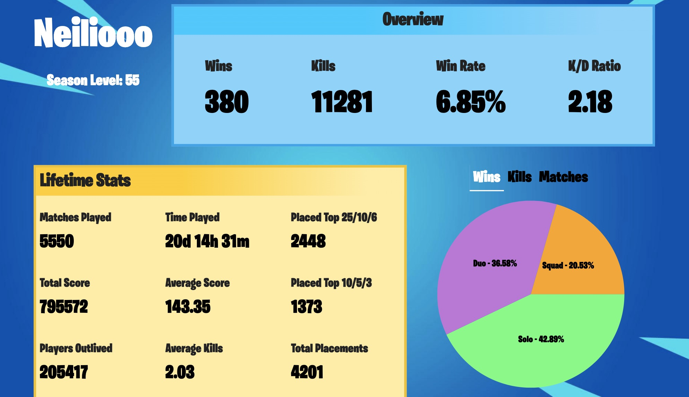

# Fortnite Plus

** **EDIT: Over 200 page views and 100 unique users!** **   
A website created to showcase anything and everything about the best (and coincidentally my favorite) game in the world, Fortnite. The site functions as a stat tracker, item shop viewer, and much more. Fortnite Plus took about **6 weeks** to build entirely scratch, with API provided courtesy of [fortniteapi.io](https://fortniteapi.io/), and original deployment was on July 7, 2020.

  
 

 
 

  
 

The website includes responsive CSS, making it both **web, tablet, and mobile-friendly**. Current support includes Samsung Galaxy 6-10, 20, iPhone 7, 7+, 8, 8+, X, XS, XS Max, Macbook Original/Pro/Air, and most Windows computers and desktops. 

  
 

Functions of the website include:  
* Player Account and Global ID lookup
* Detailed analysis of various player in-game statistics for all three game modes
* Daily and Special Item shop lookup, along with unreleased upcoming items
* In-depth item analysis with interest rating and price
* View of all current season Achievements and Challenges
* View of current season's battle pass rewards, including both free and paid tiers
* Showcase of miscellaneous statistics, such as all game maps and POIs

Built with a lot of things, including:  
* [React.js](https://reactjs.org/)  
* [Node.js](https://nodejs.org/en/)  
* [Express.js](https://expressjs.com/)  
* [Reach Router](https://reach.tech/router/)  
* [Fortnite API](https://fortniteapi.io/)  
* [Heroku Deploy](https://dashboard.heroku.com/)  

